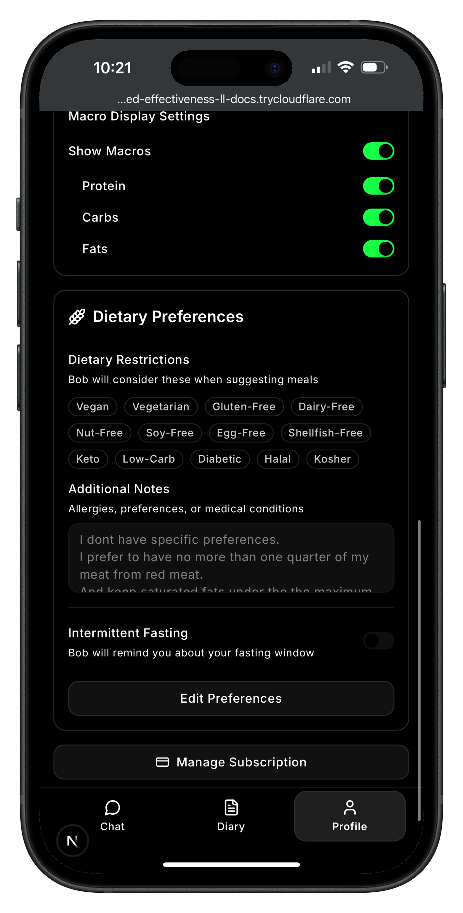

# Bob Diet Coach 🤖🥗

An AI-powered conversational diet tracking app that makes logging food and monitoring your health goals as easy as chatting with a friend. Built with Next.js 15, Convex, and Claude 4.



## 🌟 Key Features

### Conversational Food Logging

- **Natural Language**: Just tell Bob what you ate - "I had a chicken salad for lunch"
- **Photo Analysis**: Snap a photo of your meal and Bob identifies the food and estimates nutrition
- **Smart Confirmations**: Review and edit nutrition info before logging
- **Similar Meal Search**: Bob remembers your past meals and suggests them when relevant

### Intelligent Tracking

- **Weight Logging**: Track your weight progress with encouraging feedback
- **Daily Summaries**: See your calorie and macro progress at a glance
- **Weekly Calibration**: Bob automatically adjusts your calorie targets based on your actual progress
- **Sunday Insights**: Get motivating weekly summaries with progress analysis

### Personalized Experience

- **Conversational Onboarding**: Bob guides you through setup like a friendly nutritionist
- **Dietary Preferences**: Set restrictions, intermittent fasting windows, and custom notes
- **Stealth Mode**: Hide numbers for a less obsessive tracking experience
- **Real-time Sync**: Access your data across all devices instantly

## 🏗️ Architecture

```
┌─────────────────┐     ┌─────────────────┐     ┌─────────────────┐
│                 │     │                 │     │                 │
│  Next.js 15     │────▶│  Vercel AI SDK  │────▶│   Claude 4      │
│  (App Router)   │     │  (Streaming)    │     │   (Sonnet)      │
│                 │     │                 │     │                 │
└────────┬────────┘     └─────────────────┘     └─────────────────┘
         │                                                │
         │                                                │
         ▼                                                ▼
┌─────────────────┐     ┌─────────────────┐     ┌─────────────────┐
│                 │     │                 │     │                 │
│     Convex      │     │     Clerk       │     │   Polar.sh      │
│  (Real-time DB) │     │    (Auth)       │     │  (Payments)     │
│                 │     │                 │     │                 │
└─────────────────┘     └─────────────────┘     └─────────────────┘
```

### Tech Stack

- **Frontend**: Next.js 15 App Router, TailwindCSS v4, shadcn/ui
- **Backend**: Convex (real-time database + serverless functions)
- **AI**: Claude 4 via Vercel AI SDK (streaming), OpenAI embeddings
- **Auth**: Clerk (integrated with Next.js middleware)
- **Payments**: Polar.sh (subscription management)
- **Deployment**: Vercel (optimized for Next.js)

## 🚀 Getting Started

### Prerequisites

- Node.js 18+
- npm or yarn
- Accounts with: Convex, Clerk, Polar.sh, Anthropic, OpenAI

### Installation

1. **Clone the repository**

   ```bash
   git clone https://github.com/yourusername/bob-diet-coach.git
   cd bob-diet-coach
   npm install
   ```

2. **Set up environment variables**

   ```bash
   cp .env.example .env.local
   ```

   Edit `.env.local` with your credentials (see Environment Variables section)

3. **Initialize Convex**

   ```bash
   npx convex dev
   ```

   This will:
   - Create a new Convex project (or connect to existing)
   - Generate types from your schema
   - Start the Convex development server

4. **Configure webhooks**

   In your Polar.sh dashboard, set the webhook URL to:

   ```
   https://your-domain.com/api/webhooks/polar
   ```

   Enable all subscription-related events.

5. **Start the development server**

   ```bash
   npm run dev
   ```

   Open [http://localhost:5174](http://localhost:5174) to see the app.

## 🧪 Testing the App

### Manual Testing Checklist

After setting up, test these core flows:

- [ ] **Onboarding**: Create a new account and complete the conversational onboarding
- [ ] **Food Logging**:
  - [ ] Log food via text ("I ate 2 eggs and toast")
  - [ ] Upload a food photo and confirm the analysis
  - [ ] Edit nutrition values before confirming
- [ ] **Weight Tracking**: Log your weight and see the response
- [ ] **Progress View**: Check the diary page for logged items
- [ ] **Similar Meals**: Log a meal, then try logging something similar
- [ ] **Dietary Preferences**: Set restrictions in settings and see Bob respect them
- [ ] **Mobile Experience**: Test on mobile devices for responsive design
- [ ] **Cross-Device Sync**: Log on one device, verify on another

### Known Limitations

- **Data Export**: Currently no way to export your data (coming soon)
- **Freemium Limits**: 5 messages and 2 photos per day for free users
- **Browser Support**: Optimized for modern browsers (Chrome, Safari, Firefox)

## 🔧 Environment Variables

Create a `.env.local` file with these variables:

```env
# Convex
CONVEX_DEPLOYMENT=your_deployment_here
NEXT_PUBLIC_CONVEX_URL=https://your-deployment.convex.cloud

# Clerk Authentication
NEXT_PUBLIC_CLERK_PUBLISHABLE_KEY=pk_test_...
CLERK_SECRET_KEY=sk_test_...
NEXT_PUBLIC_CLERK_SIGN_IN_URL=/sign-in
NEXT_PUBLIC_CLERK_SIGN_UP_URL=/sign-up
NEXT_PUBLIC_CLERK_AFTER_SIGN_IN_URL=/chat
NEXT_PUBLIC_CLERK_AFTER_SIGN_UP_URL=/pricing

# Polar.sh Payments
POLAR_ACCESS_TOKEN=polar_oat_...
POLAR_ORGANIZATION_ID=...
POLAR_WEBHOOK_SECRET=...

# AI Services
ANTHROPIC_API_KEY=sk-ant-api03-...
OPENAI_API_KEY=sk-proj-...

# App URL
NEXT_PUBLIC_APP_URL=http://localhost:5174
```

## 📁 Project Structure

```
bob-diet-coach/
├── app/                    # Next.js App Router
│   ├── (app)/             # Authenticated routes
│   │   ├── chat/          # Main chat interface
│   │   ├── diary/         # Food & weight history
│   │   └── settings/      # User preferences
│   ├── api/               # API routes
│   │   └── chat/stream-v2 # Claude streaming endpoint
│   └── components/        # React components
├── convex/                # Backend functions
│   ├── schema.ts          # Database schema
│   ├── foodLogs.ts        # Food tracking logic
│   ├── weightLogs.ts      # Weight tracking
│   ├── vision.ts          # Photo analysis
│   └── calibration.ts     # Weekly adjustments
├── docs/                  # Documentation
└── public/                # Static assets
```

## 🎯 Core Concepts

### Daily Threads

Each day gets a new conversation thread. Bob greets you with insights from yesterday and helps you stay on track.

### Confirmation Bubbles

When you log food, Bob shows an editable confirmation bubble. You can adjust portions and macros before saving.

### Weekly Calibration

Every Sunday, Bob analyzes your week and adjusts your calorie targets based on actual vs expected weight change.

### Smart Context

Bob maintains conversation context but limits it to recent messages for performance. Tool loading is optimized based on intent detection.

## 🐛 Reporting Issues

For alpha testing feedback:

1. Check existing issues in GitHub
2. Create a new issue with:
   - Steps to reproduce
   - Expected vs actual behavior
   - Screenshots if applicable
   - Browser/device info

## 🤝 Contributing

This project is currently in alpha. We welcome feedback and bug reports!

1. Fork the repository
2. Create your feature branch (`git checkout -b feature/amazing-feature`)
3. Commit your changes (`git commit -m 'Add amazing feature'`)
4. Push to the branch (`git push origin feature/amazing-feature`)
5. Open a Pull Request

## 📄 License

This project is proprietary software. All rights reserved.

## 🙏 Acknowledgments

Built with amazing open source technologies:

- [Next.js](https://nextjs.org/) - The React framework
- [Convex](https://convex.dev/) - The reactive backend
- [Clerk](https://clerk.dev/) - Authentication made simple
- [Vercel AI SDK](https://sdk.vercel.ai/) - AI streaming made easy
- [shadcn/ui](https://ui.shadcn.com/) - Beautiful components
- [Polar.sh](https://polar.sh/) - Subscription management

---

**Questions?** Join our [Discord](#) or email support@bobdietcoach.com

_Bob is waiting to help you reach your health goals! 🎯_
