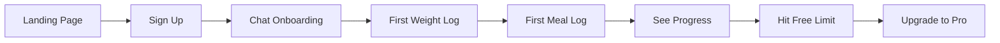

# Bob Diet Coach - Complete Master Documentation 🏆

*Last Updated: December 2024*

## Table of Contents
1. [Executive Summary](#executive-summary)
2. [Product Vision & Philosophy](#product-vision--philosophy)
3. [Technical Architecture](#technical-architecture)
4. [Core Features - Implemented](#core-features---implemented)
5. [Features in Development](#features-in-development)
6. [User Experience Flow](#user-experience-flow)
7. [Data Architecture](#data-architecture)
8. [AI Implementation](#ai-implementation)
9. [Business Model](#business-model)
10. [UI/UX Design](#uiux-design)
11. [Development Roadmap](#development-roadmap)
12. [Success Metrics](#success-metrics)

---

## Executive Summary

Bob Diet Coach is an AI-powered diet coaching SaaS that revolutionizes weight management through natural conversation. Unlike traditional calorie counting apps that rely on generic formulas, Bob learns each user's unique metabolism by observing actual weight results, providing truly personalized coaching based on what YOUR scale shows, not what calculators predict.

### Key Differentiators
- **Conversational Interface** - No forms, just natural chat
- **Results-Based Learning** - Calibrates to YOUR actual weight changes
- **Stealth Mode** - For users who prefer not to see numbers
- **Photo Intelligence** - Advanced food recognition that improves over time
- **Real Metabolism Discovery** - Learns what calories actually do to YOUR body

---

## Product Vision & Philosophy

### Core Philosophy: "Chat First, Everything Else Second"

Every interaction happens through natural conversation with Bob. Users talk to him like a knowledgeable friend who remembers their entire diet journey. The UI provides visualizations and history, but the primary interface is always the chat.

### Design Principles

1. **Frictionless Logging** - Speaking is easier than forms
2. **Personalized Intelligence** - Bob learns each user's patterns
3. **Emotional Support** - Encouragement over judgment
4. **Flexible Tracking** - From detailed macros to simple habits
5. **Privacy First** - User data never leaves the platform

### Target Users

- **Primary**: People who've tried calorie counting but found it tedious
- **Secondary**: Those with complex relationships with numbers/weight
- **Tertiary**: Fitness enthusiasts wanting AI-powered optimization

---

## Technical Architecture

### Current Implementation (v2 - Convex Agent)

```
┌─────────────────┐     ┌─────────────────┐     ┌─────────────────┐
│   React Router  │────▶│  Convex Agent   │────▶│   Claude API    │
│   Frontend v7   │     │   SDK + Tools   │     │   (via Vercel)  │
└─────────────────┘     └─────────────────┘     └─────────────────┘
         │                       │                         │
         │                       ▼                         │
         │              ┌─────────────────┐               │
         └─────────────▶│  Convex DB      │◀──────────────┘
                        │  (Real-time)    │
                        └─────────────────┘
```

### Core Stack

- **Frontend**: React Router v7 + TypeScript
- **UI Framework**: TailwindCSS v4 + shadcn/ui
- **Backend**: Convex (real-time database + serverless functions)
- **AI Integration**: 
  - Convex Agent SDK (@convex-dev/agent)
  - Claude 4 Sonnet (all interactions including photo analysis)
  - OpenAI Embeddings (text-embedding-3-small)
- **Auth**: Clerk (integrated)
- **Payments**: Polar.sh (integrated)
- **Deployment**: Vercel
- **File Storage**: Convex File Storage (for temporary photo uploads)

### Convex-Powered Architecture

Bob leverages Convex's real-time capabilities throughout:

1. **Real-time Data Sync**
   - All UI updates instantly via Convex subscriptions
   - No polling or manual refreshes needed
   - Seamless multi-device experience

2. **Scheduled Functions**
   - `ctx.scheduler.runAfter()` for immediate background tasks
   - Cron jobs for periodic calibration and reminders
   - Automatic usage limit resets at midnight

3. **Vector Search**
   - Native Convex vector indices for embeddings
   - Semantic search across all food logs and photos
   - Pattern matching for insights

4. **File Storage**
   - Secure image hosting with storage IDs
   - No base64 bloat or localStorage issues
   - Automatic garbage collection

5. **Internal Functions**
   - Chain complex operations with `internalMutation`
   - Background processing without blocking UI
   - Type-safe function composition

---

## Core Features - Implemented

### 1. Photo Analysis ✅ [COMPLETED]

Advanced food recognition with intelligent learning:
- **Convex File Storage** for secure image hosting
- **Claude Vision API** for accurate food recognition  
- **Vector similarity search** finds past similar meals
- **One-click confirmation** for frictionless logging
- **Smart error handling** with personality
- **Usage limits** enforced (2/day free, unlimited Pro)

### 2. Weight Tracking ✅

Intelligent weight logging with trend analysis and learning:

```javascript
User: "Weight is 82.5kg today"
Bob: [uses logWeight tool]
"Logged 82.5kg! Your 7-day average is 82.3kg, down 0.4kg from last week.

Based on YOUR results: eating 1,520 avg calories = 0.4kg loss per week.
You're learning exactly how YOUR body responds! 📉"
```

Bob tracks moving averages and learns the relationship between your intake and weight changes.

### 3. Progress Visualization ✅

Real-time progress cards showing:
- Daily calorie progress
- Macro breakdown (protein, carbs, fats)
- Weight trend visualization
- Adherence scoring

### 4. Stealth Mode ✅

For users who prefer qualitative feedback:

```javascript
// Standard Mode
Bob: "You've consumed 1,250 calories with 95g protein"

// Stealth Mode
Bob: "You're on track for the day! Plenty of room for a satisfying dinner 🎯"
```

### 5. Smart Onboarding ✅

Conversational profile building:

```javascript
Bob: "What's your main goal - losing, gaining, or maintaining weight?"
User: "I want to lose 10kg"
Bob: "Great goal! To personalize your plan, I need a few details. What's your current weight?"
// Continues gathering: height, age, activity level, display preferences
```

### 6. Vector Search & Embeddings ✅

All conversations and food logs are embedded for semantic search:

```javascript
User: "What did I eat last time I felt bloated?"
Bob: [searches embeddings]
"Looking at your history, bloating mentions appear after:
- Pizza (3 times)
- Ice cream (2 times)
- Large pasta dishes
Would you like tips for managing this?"
```

### 7. Usage Tracking & Limits ✅

Freemium enforcement:
- 5 AI chats per day (free tier)
- 2 photo analyses per day (free tier)
- Unlimited for Pro users
- Resets at midnight user timezone

### 8. Real-time Sync ✅

- All data updates instantly across devices
- No manual refresh needed
- Convex subscriptions handle real-time updates

---

## Features in Development

### 1. Photo Analysis 📸 [COMPLETED]

Advanced food recognition with learning capabilities:

```javascript
User: [uploads burger photo]
Bob: [analyzes with Claude Vision + searches similar photos]
"I see a delicious burger! Here's what I'm tracking:
- Burger with bun: 650 calories, 35g protein
- Based on 3 similar photos, this looks like your Five Guys burger (820 cal average)

[Yes, log it!] button

If this isn't accurate, just tell me what to change!"
```

**Implementation Details:**
- **Convex File Storage** for secure image hosting (no base64!)
- **Claude Vision API** for food recognition
- **Vector embeddings** for similarity search
- **One-click confirmation** for frictionless logging
- **Smart error handling** ("Hey, that's a selfie!")
- **Usage limits enforced** (2/day free, unlimited Pro)

### 2. Dynamic Metabolism Calibration 🎯 [NEXT PRIORITY]

Bob learns each user's actual metabolism using rolling averages:

```javascript
// After 14 days of data
Bob: "I've noticed something interesting, Sarah. Based on your intake and weight changes, 
your metabolism runs about 200 calories slower than typical calculators suggest. 
I'm adjusting your daily target from 1,500 to 1,300 calories for steady progress. 
This personalization is why I'm different from generic apps!"
```

**Implementation:**
- 7-day rolling averages for weight and calories
- Dynamic calibration triggers (not fixed weekly)
- Confidence scoring based on data quality
- Automatic target adjustments

### 3. Pattern Recognition & Insights 🧠 [PLANNED]

Leveraging embeddings for breakthrough insights:

```javascript
Bob: "I've discovered a pattern! You lose weight most effectively when you:
- Eat protein at breakfast (0.3kg more loss per week)
- Keep dinners under 500 calories
- Have that weekly pizza on Fridays instead of Saturdays"
```

### 4. Plateau Detection & Intervention 📊 [PLANNED]

Automatic detection and science-based solutions:

```javascript
Bob: "You've maintained 78kg for 2 weeks despite perfect adherence. 
This is a normal plateau! I recommend a 2-day refeed at maintenance calories 
to reset your hormones. Trust the process - this works for 85% of users!"
```

### 5. Smart Reminders 🔔 [PLANNED]

Context-aware nudges:

```javascript
// If user typically logs breakfast by 9am but hasn't today
Bob (10am): "Good morning! Haven't seen your breakfast log yet. 
Everything okay, or just running late? ☕"
```

---

## User Experience Flow

### New User Journey



### Daily User Flow

1. **Morning Check-in**
   - Bob asks for weight
   - Shows overnight change
   - Motivational message

2. **Meal Logging**
   - Natural language or photo
   - Instant confirmation
   - Running totals update

3. **Evening Review**
   - Daily summary
   - Tomorrow's guidance
   - Achievement celebration

### Power User Features

- Bulk photo upload for meal prep
- Voice notes (future)
- Export data for doctors
- Custom macro targets

---

## Data Architecture

### Core Database Schema

```typescript
// User Profiles - Core user data and preferences
userProfiles: {
  userId: string
  name: string
  currentWeight: number
  targetWeight: number
  height: number
  age: number
  gender: "male" | "female" | "other"
  activityLevel: "sedentary" | "light" | "moderate" | "active" | "very_active"
  goal: "cut" | "maintain" | "gain"
  targetCalories: number
  targetProtein: number
  displayMode: "standard" | "stealth"
  isPro: boolean
  movingAverages?: {
    weight7d: number
    calories7d: number
    protein7d: number
    lastUpdated: number
  }
}

// Food Logs - Every meal tracked
foodLogs: {
  userId: string
  date: string // YYYY-MM-DD
  meal: "breakfast" | "lunch" | "dinner" | "snack"
  foods: Array<{
    name: string
    calories: number
    protein: number
    carbs: number
    fat: number
  }>
  totalCalories: number
  totalProtein: number
  embedding?: number[] // For semantic search
  aiEstimated: boolean
  confidence: "high" | "medium" | "low"
}

// Weight Logs - Daily weigh-ins
weightLogs: {
  userId: string
  weight: number
  unit: "kg" | "lbs"
  date: string
  trend7d?: number // 7-day moving average
}

// Photo Analyses - AI vision results
photoAnalyses: {
  userId: string
  imageUrl: string
  analysis: object // Detailed food breakdown
  metadata: {
    visualDescription: string
    platingStyle: string
    portionSize: string
    possibleVenue?: string
  }
  embedding: number[] // For similarity search
  confirmed: boolean
}

// Thread Management (via Convex Agent)
threads: {
  threadId: string
  userId: string
  createdAt: number
  lastMessageAt: number
  metadata: object
}

// Usage Tracking - Freemium limits
usageTracking: {
  userId: string
  date: string
  chatCount: number
  photoAnalysisCount: number
  lastResetAt: number
}

// Calibration History
calibrationHistory: {
  userId: string
  oldCalorieTarget: number
  newCalorieTarget: number
  reason: string
  confidence: "high" | "medium" | "low"
  dataPointsAnalyzed: number
}
```

### Data Flow

1. **User Input** → Chat message or photo
2. **Bob Processing** → Tools determine action
3. **Database Update** → Convex mutations
4. **Real-time Sync** → All clients update
5. **Analytics** → Background calculations
6. **Insights** → Bob shares learnings

---

## AI Implementation

### Bob's Agent Architecture

```javascript
const bobAgent = new Agent(components.agent, {
  // Primary model for conversations
  chat: anthropic.chat("claude-sonnet-4-20250514"),
  
  // System instructions defining Bob's personality
  instructions: `You are Bob, a friendly and knowledgeable AI diet coach who learns 
  from real results, not generic formulas. You understand that weight change is the 
  ultimate truth, and you adjust recommendations based on what each user's scale 
  actually shows, not what calculators predict...`,
  
  // Tools Bob can use
  tools: {
    confirmFood,          // Parse and confirm food
    logFood,              // Save to database
    logWeight,            // Track weight
    showProgress,         // Display stats
    analyzePhoto,         // Vision analysis
    findSimilarMeals,     // Vector search
    getCalibrationInsights, // Learn from weight results
    getWeightTrends       // Show moving averages
  },
  
  // Embeddings for semantic search
  textEmbedding: openai.embedding("text-embedding-3-small"),
  
  // Allow multi-step operations
  maxSteps: 5,
  
  // Usage tracking for billing
  usageHandler: async (ctx, { userId, usage }) => {
    await trackUsage(ctx, userId, usage);
  }
});
```

### Tool Design Pattern

Each tool follows this structure:

```javascript
export const toolName = createTool({
  description: "Clear description for the AI",
  args: z.object({
    // Zod schema for validation
  }),
  handler: async (ctx, args): Promise<ResultType> => {
    // 1. Validate permissions/limits
    // 2. Perform action
    // 3. Update database
    // 4. Return structured response
  }
});
```

### Conversation Management

- **Threads** persist across sessions
- **Context** includes recent messages + user profile
- **Embeddings** enable semantic search
- **Streaming** for natural feel

---

## Business Model

### Pricing Tiers

#### Free Tier
- 5 AI conversations per day
- 2 photo analyses per day
- Basic progress tracking
- 7-day history

#### Pro Tier ($9.99/month)
- Unlimited AI conversations
- Unlimited photo analyses
- Advanced insights & patterns
- Full history & export
- Priority support
- Metabolism calibration
- Plateau intervention

### Monetization Strategy

1. **Hook**: Free tier lets users experience Bob's magic
2. **Habit**: Daily interactions build dependency
3. **Limit**: Hit daily limits during active use
4. **Convert**: Upgrade for unlimited coaching

### Conversion Drivers

```javascript
// Strategic upgrade prompts
Bob: "I'd love to analyze this photo, but you've used today's free analyses. 
     Pro users get unlimited photo insights that improve over time! 
     Want to upgrade for just $9.99/month?"

// Value demonstration
Bob: "I've noticed you could benefit from metabolism calibration - 
     a Pro feature that could help break through this plateau!"

// Social proof
Bob: "Pro users lose 2.3x more weight on average. 
     Ready to accelerate your progress?"
```

---

## UI/UX Design

### Design System

- **Colors**: Warm, earthy palette
  - Primary: Forest Green (#2D5016)
  - Secondary: Warm Brown (#8B4513)
  - Accent: Sunrise Orange (#FF6B35)
  - Background: Soft Cream (#FFF8DC)

- **Typography**:
  - Headers: Inter (clean, modern)
  - Body: System fonts (performance)
  - Chat: SF Pro (native feel)

- **Components**: 
  - Card-based layouts
  - Smooth animations
  - Touch-friendly targets
  - Responsive grids

### Mobile-First Screens

#### 1. Chat Dashboard (Primary)
```
┌─────────────────────┐
│ Daily Stats Cards   │ (6 cards: goal, calories, etc.)
├─────────────────────┤
│                     │
│   Chat with Bob     │ (80% of screen)
│                     │
├─────────────────────┤
│ [📷] [🎤] [Type...] │ (Input bar)
└─────────────────────┘
```

#### 2. Food Diary
```
┌─────────────────────┐
│ Today - 1,234 cal   │
├─────────────────────┤
│ 🌅 Breakfast (412)  │
│ 🌞 Lunch (523)      │
│ 🌙 Dinner (299)     │
├─────────────────────┤
│ [+ Add Meal]        │
└─────────────────────┘
```

#### 3. Weight Progress
```
┌─────────────────────┐
│   Weight Chart      │
│     📉              │
├─────────────────────┤
│ Current: 82.5kg     │
│ Goal: 75kg          │
│ Progress: -7.5kg    │
└─────────────────────┘
```

#### 4. Profile & Settings
```
┌─────────────────────┐
│ Profile Info        │
├─────────────────────┤
│ Display Mode        │
│ Macro Preferences   │
│ Reminder Settings   │
├─────────────────────┤
│ Subscription: Pro ✓ │
└─────────────────────┘
```

### Interaction Patterns

- **Pull to refresh** (mobile)
- **Swipe to delete** (food logs)
- **Long press** for options
- **Haptic feedback** on actions
- **Smooth transitions** between states

---

## Development Roadmap

### Phase 1: Core Experience ✅ [COMPLETE]
- Basic chat with Bob
- Food/weight logging  
- Progress tracking
- Freemium limits
- Real-time sync

### Phase 2: Intelligence Layer 🚧 [CURRENT]
- ✅ Photo analysis with learning
- 🔄 Metabolism calibration (next priority)
- 📅 Pattern recognition
- 📅 Similar meal search

### Phase 3: Engagement Features 📅 [Q1 2025]
- Smart reminders via Convex cron
- Email summaries
- Plateau detection algorithms
- Advanced insights dashboard

### Phase 4: Platform Expansion 📅 [Q2 2025]
- WhatsApp integration
- Voice input processing
- Apple Health sync
- Meal planning with Convex functions

### Phase 5: Social & Gamification 📅 [Q3 2025]
- Progress sharing
- Challenges system
- Community features
- Achievement badges

---

## Success Metrics

### User Engagement KPIs
- **Daily Active Users**: 60%+ (industry avg: 15%)
- **Messages per DAU**: 8+ (3+ meals, weight, chat)
- **Photo uploads**: 2+ per day for Pro users
- **7-day retention**: 75%+ (industry avg: 20%)
- **30-day retention**: 40%+ (industry avg: 10%)

### Business KPIs
- **Free to Pro conversion**: 20%+ in first month
- **Monthly churn**: <5% (industry avg: 10%)
- **LTV:CAC ratio**: 3:1 within 6 months
- **MRR growth**: 25%+ month-over-month
- **NPS score**: 50+ (promoters love Bob!)

### Health Outcomes
- **Goal achievement**: 70%+ reach target weight
- **Avg weekly loss**: 0.5-1kg (sustainable)
- **Calibration accuracy**: 85%+ predictions correct
- **Plateau resolution**: 80%+ break through

### Technical Performance
- **Response time**: <2s for Bob replies
- **Uptime**: 99.9%+ (Convex SLA)
- **Error rate**: <0.1% of interactions
- **Sync latency**: <100ms real-time updates

---

## Implementation Guidelines

### Code Quality Standards
- **TypeScript** everywhere (strict mode)
- **Component patterns** from shadcn/ui
- **Error boundaries** for graceful failures
- **Optimistic updates** for instant feel
- **Accessibility** (WCAG 2.1 AA)

### Testing Strategy
- **Unit tests** for business logic
- **Integration tests** for tools
- **E2E tests** for critical paths
- **Load testing** before launch
- **A/B tests** for conversion

### Security & Privacy
- **Data encryption** at rest and transit
- **GDPR compliant** data handling
- **User data export** on request
- **Secure file uploads** (photos)
- **Rate limiting** on all endpoints

### Deployment Process
1. **Development** → Local testing
2. **Preview** → Vercel preview deploys
3. **Staging** → Full environment test
4. **Production** → Gradual rollout
5. **Monitoring** → Real-time alerts

---

## Competitive Advantages

### vs. MyFitnessPal
- **Natural language** vs form filling
- **Learns your metabolism** vs generic formulas
- **Conversational** vs database UI
- **AI-powered insights** vs basic tracking

### vs. Noom
- **Affordable** ($9.99 vs $60/month)
- **AI coach always available** vs scheduled humans
- **Instant responses** vs delayed feedback
- **Personalized to metabolism** vs one-size-fits-all

### vs. ChatGPT
- **Purpose-built for dieting** vs general
- **Persistent memory** vs session-based
- **Integrated tracking** vs just advice
- **Visual progress** vs text only

---

## Future Vision

### Year 1: Foundation
- Perfect the core chat experience
- Build loyal user base
- Achieve product-market fit
- Sustainable unit economics

### Year 2: Expansion
- WhatsApp/SMS channels
- Voice interaction
- Wearable integration
- International markets

### Year 3: Platform
- API for developers
- White-label solution
- Corporate wellness
- Insurance partnerships

### Long-term: Health Companion
- Beyond diet (exercise, sleep, stress)
- Medical provider integration
- Predictive health insights
- Preventive care platform

---

## Conclusion

Bob Diet Coach represents a paradigm shift in diet tracking - from tedious data entry to natural conversation with an AI that truly understands each user's unique body. By combining cutting-edge AI with thoughtful UX and real-time infrastructure, we're building the future of personalized health coaching.

**The magic is in the details**: Bob remembers everything, learns continuously, and adapts to each user. He's not just a calorie counter - he's a knowledgeable friend who happens to be available 24/7 and gets smarter every day.

**Ready to build the future of diet coaching? Let's make Bob amazing! 🚀**

---

*This document serves as the single source of truth for Bob Diet Coach. Update it as features evolve and lessons are learned.*